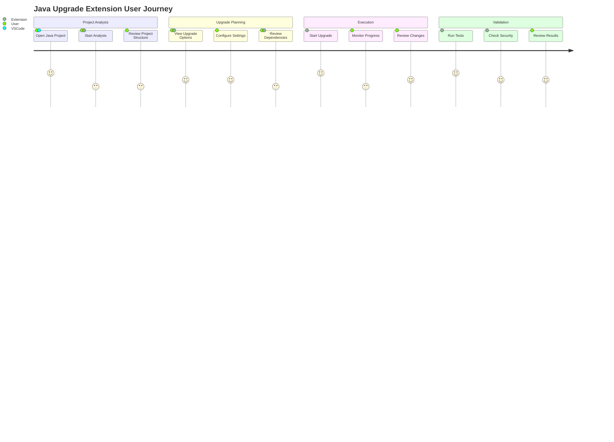
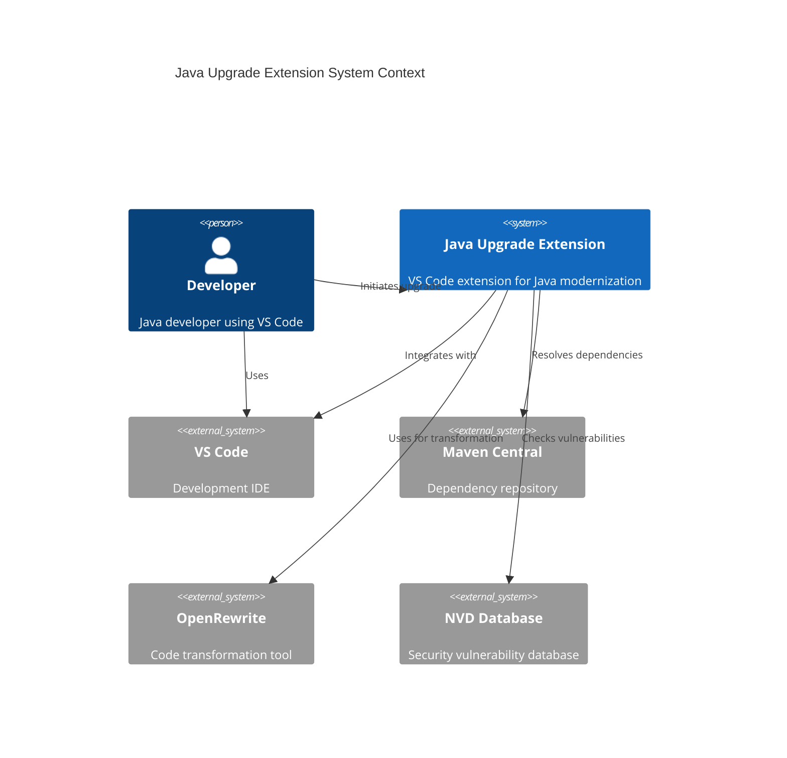
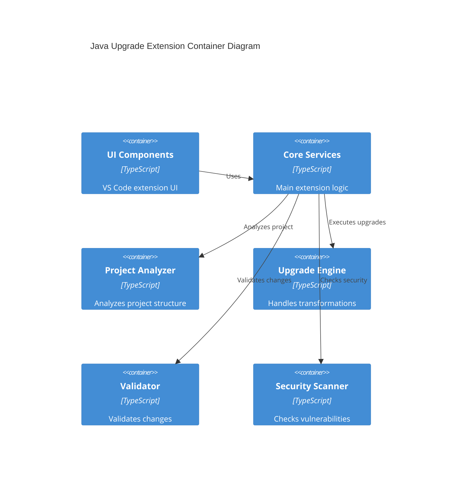
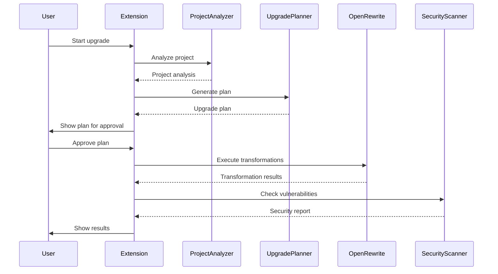
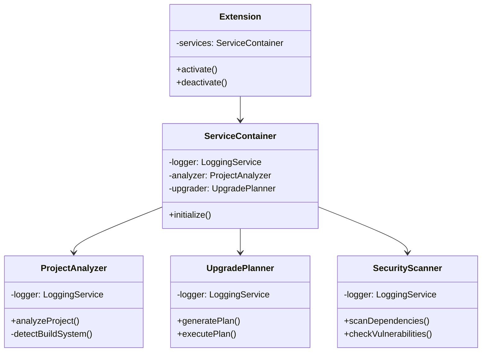
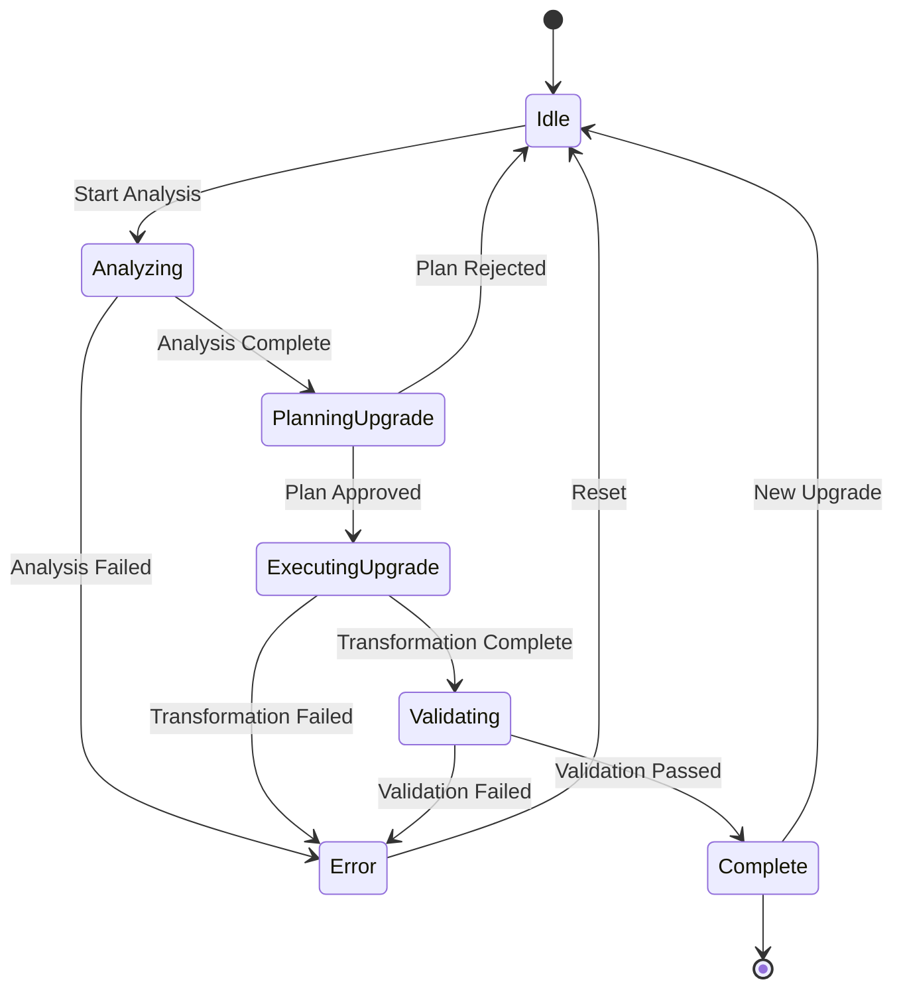

# Architecture Documentation

## User Journey Diagram

## C4 Context Diagram

## C4 Container Diagram

## Sequence Diagram

## Class Diagram

## State Diagram

### Key Components

1. **Core Services**
   - Project Analysis
   - Upgrade Planning
   - Code Transformation
   - Security Validation

2. **Support Services**
   - Logging
   - Configuration Management
   - Progress Tracking
   - Telemetry

3. **Integration Points**
   - VS Code API
   - OpenRewrite
   - Maven/Gradle
   - NVD Database

### Data Flow

1. **Input Flow**
   - Project Structure Analysis
   - User Configuration
   - Dependency Information
   - Security Updates

2. **Processing Flow**
   - Code Analysis
   - Transformation Rules
   - Validation Checks
   - Security Scanning

3. **Output Flow**
   - Code Changes
   - Build Updates
   - Security Reports
   - Progress Updates
